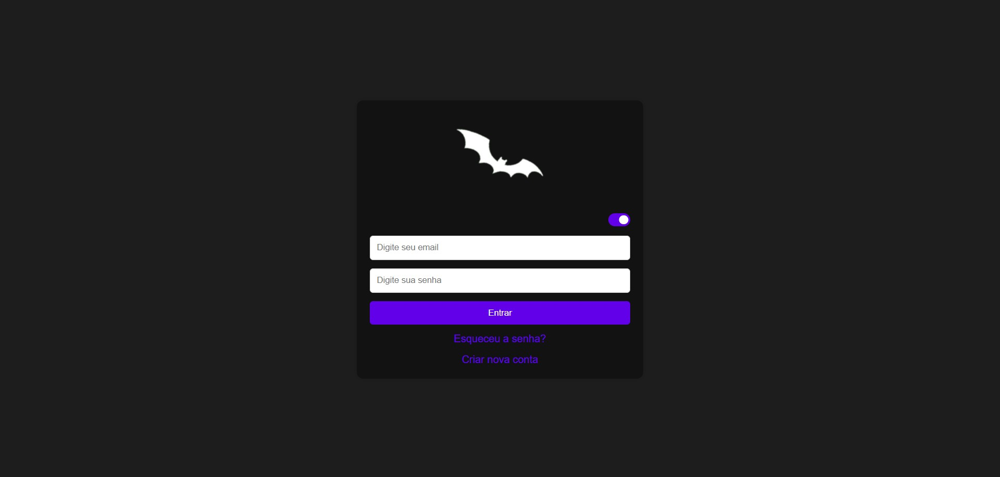
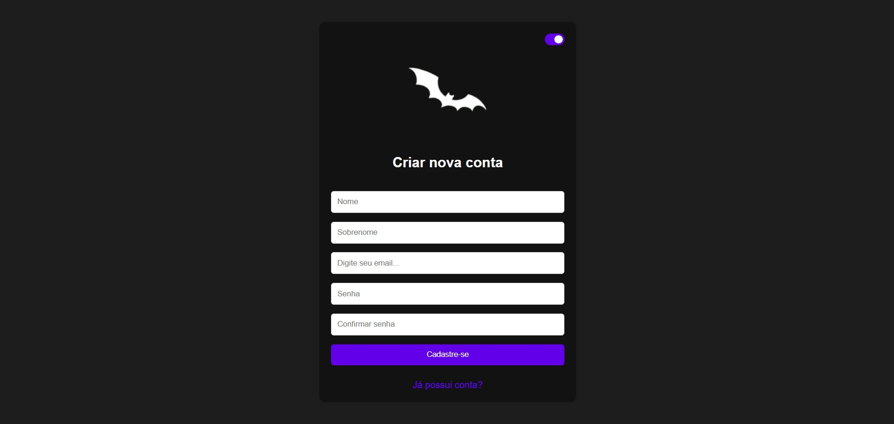
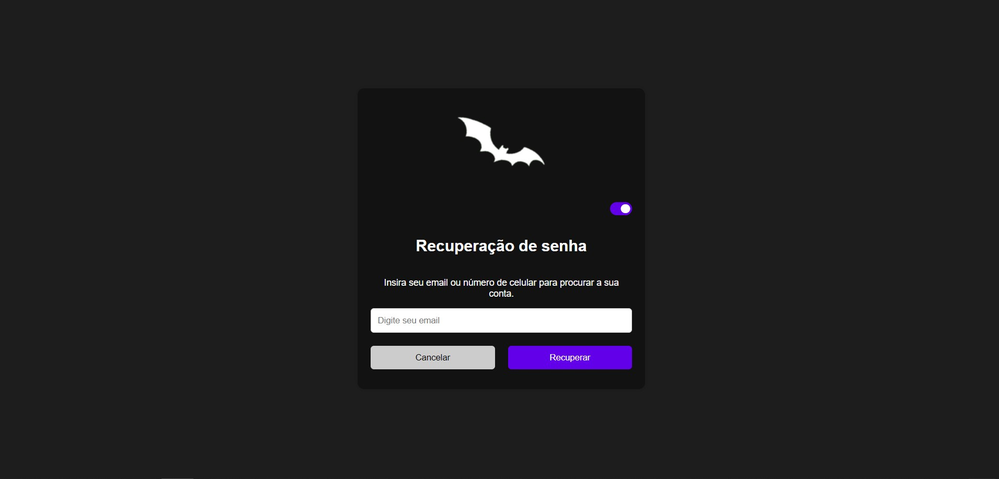
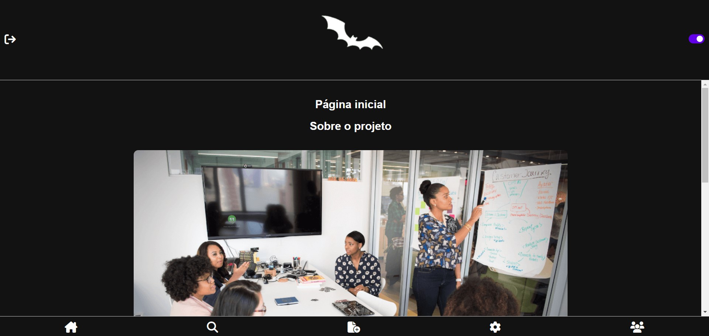
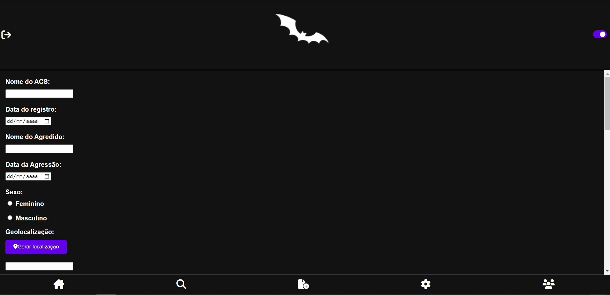
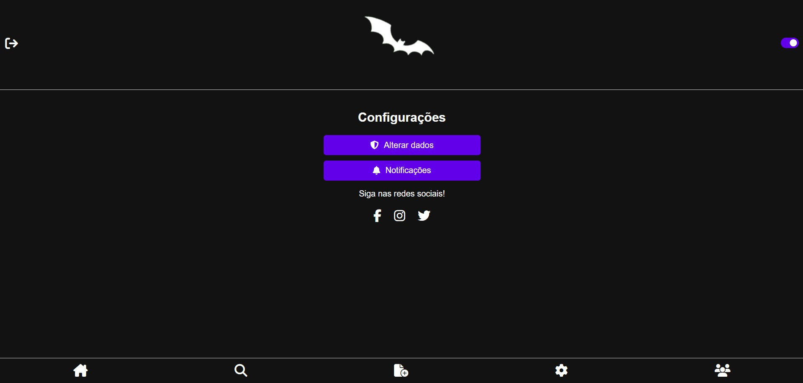
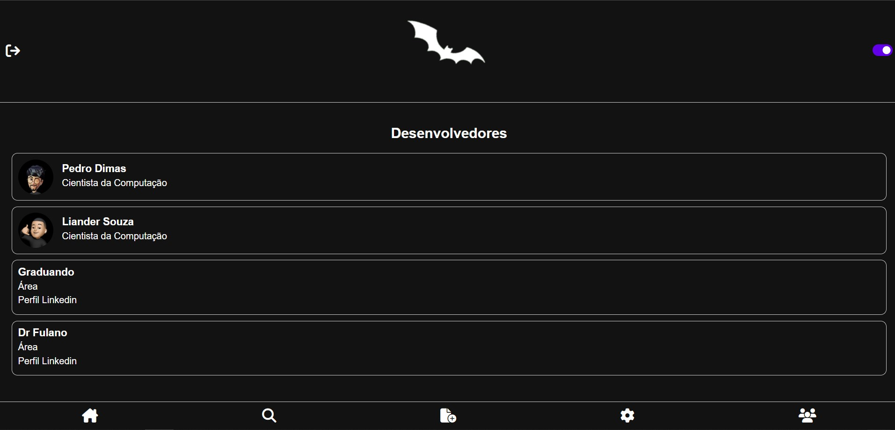

<!-- Título centralizado com imagem ao lado -->

  
  <h1 align="center">Sismorcego</h1>

**Páginas HTML:**

  

- **[Index](index.html)**: esta página oferece uma interface de login com validação básica utilizando armazenamento local (localStorage) para simular a autenticação de usuário.

  

- **[Cadastro](cadastro.html)**: Esta página é uma interface para criar uma nova conta no sistema "Sismorcego". O formulário coleta informações básicas (nome, sobrenome, email e senha) e valida se as senhas coincidem e se o email já está registrado. Se tudo estiver correto, os dados são salvos no localStorage e o usuário é redirecionado para a página de login. A página também inclui uma funcionalidade para alternar entre temas claros e escuros.

  

- **[Recuperar senha](recuperasenha.html)**: esta página oferece uma interface para a recuperação de senha, com suporte para notificações se o usuário permitir. Ela também inclui um botão para alternar entre temas e um botão para cancelar e retornar à página de login.

  

- **[Inicial](inicial.html)**: Esta página serve como a página inicial do sistema "Sismorcego". Ela exibe informações sobre o projeto, incluindo imagens e descrições relacionadas a reuniões e apresentações. A página tem uma seção para alternar entre temas claros e escuros e inclui um rodapé com botões de navegação para outras partes do sistema. O JavaScript incluído (theme.js) é responsável pela funcionalidade de troca de tema.

  

- **[Pesquisar](pesquisar.html)**: Esta página é para visualizar e pesquisar registros armazenados no localStorage do navegador. A tabela exibe vários atributos dos registros e permite excluir registros. A pesquisa é realizada dinamicamente à medida que o usuário digita no campo de pesquisa. O JavaScript associado é responsável por carregar, excluir e pesquisar registros, além de controlar a troca de temas da página.

  

- **[Registro](registro.html)**:  Esta página é usada para registrar informações detalhadas sobre eventos e agressões. Inclui campos para informações básicas, geolocalização, e permite a captura de fotos usando a câmera ou a galeria do dispositivo. O JavaScript é responsável por processar o formulário, gerar e salvar a localização, e lidar com a captura de fotos. A página também permite alternar o tema e navegar entre diferentes seções do site.

  

- **[Configurações](configuracoes.html)**: Esta página é destinada à configuração e personalização do sistema "Sismorcego". Inclui opções para alterar dados, configurar notificações e links para redes sociais. A funcionalidade de troca de tema é incluída, e a navegação é facilitada por botões no rodapé. O CSS específico para esta página é carregado através do arquivo configuracoes.css, enquanto o theme.js gerencia a funcionalidade de alternância de temas.

  

- **[Desenvolvedores](desenvolvedores.html)**: Apresentar informações sobre os desenvolvedores envolvidos no projeto.

